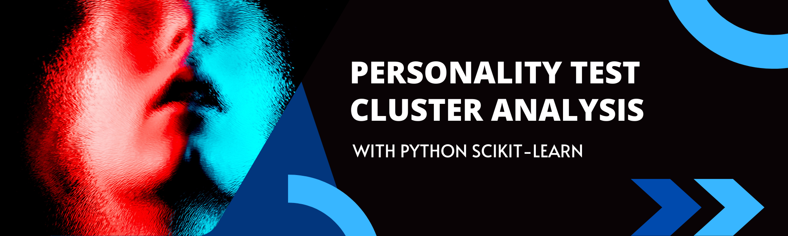

# ml-clustering-personality

Author:  Erin James Wills, ejw.data@gmail.com  

  
<cite>Photo by [Joshua Fuller](https://unsplash.com/@joshuafuller?utm_source=unsplash&utm_medium=referral&utm_content=creditCopyText) on [Unsplash](https://unsplash.com/s/photos/personality-types?utm_source=unsplash&utm_medium=referral&utm_content=creditCopyText)</cite>

## Overview  

  
After helping a person with manipulating the data and disucssing some methods that they could use to classify the model, I decided to play with the data set and perform my own review.  The goal of the analysis is to compare the clustering results and determine if any intersting interpretations can be obtained from the clusters.   

   

## Technologies  
*  Python
*  Scikit-Learn 

   

## Methods  
*  Train Test Split  
*  Hyperparameter Tuning  
*  Multiple Clustering Comparision
*  Scoring    

## Data Source  

https://www.kaggle.com/lucasgreenwell/ocean-five-factor-personality-test-responses  

   

## Setup and Installation  
1. Environment needs the following:  
    *  Python 3.6+  
    *  Scikit-Learn  
1. Activate your environment
1. Clone the repo to your local machine
1. Start Jupyter Notebook within the environment from the repo
1. Run `exploratory_analysis.ipynb`  

 

